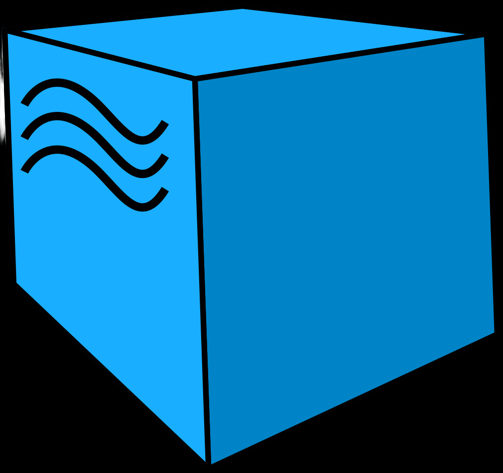

### Hi there 👋

<!--About me-->

## :technologist:About me
- I'm manual and automation Engineer
- I work QA engineer since 2013
- I write autotests in Python and TypeScript
- Contacts:

  &#8287;&#8287;&#8287;&#8287;&#8287;
  
  &#8287;
  

<!--Education-->

## :man_student:Education
<table width="100%" border='0'>
   <tr> 
    <td width="30%" valign="bottom"></td><td valign="middle">Nosov Magnitogorsk State Technical University.  Institute of Automation and Computer Engineering. Specialist 2012</td></tr>
  </table>
   
  
  #### Additional Education:
<table width="100%" border='0'>
   <tr><td width="30%" valign="bottom"></td><td valign="middle">School of Test Automation Engineers <a target="_blank" href="https://qa.guru">qa.guru</a>.</td></tr>
  </table>

<!--Stack and tools-->

&#8287;&#8287;&#8287;&#8287;&#8287;
## :computer:Stack and tools

  <code></code>
  <code></code>
  <code></code>
  <code></code>
  <code></code>
  <code></code>
  <code></code>
  <code></code>
  <code></code>
  <code></code>
  <code></code>
  <code></code>
  <code></code>
  <code></code>

  
  
<!--Projects-->

## :floppy_disk: Projects
###  [Link](https://github.com/aleksandrzavialov/summer_patio_web_autotests)

###  [Link](https://github.com/aleksandrzavialov/spotify_api_tests)

###  [Link](https://github.com/aleksandrzavialov/python-gismeteo-app)

<!--Git Stats-->

&#8287;&#8287;&#8287;&#8287;&#8287;
## :bar_chart:Git stats

 

